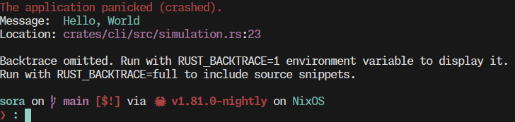
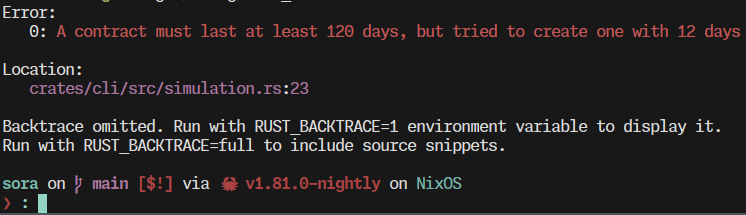

# Requirements

- Rust 1.81.0 nightly (install with `rustup toolchain install nightly`)
- [`cargo-tarpaulin`](https://github.com/xd009642/tarpaulin) (Code coverage
  reporter, install with `cargo install cargo-tarpaulin`)
- A containerization tool supporting the compose spec
  ([`podman compose`](https://github.com/containers/podman-compose) or
  [`docker compose`](https://github.com/docker/compose) for example)
- The [`sqlx cli`](https://crates.io/crates/sqlx-cli) (install with
  `cargo install sqlx-cli`); Necesarry to run database migrations

# Dependencies

I will explain here the different choices for the dependencies of this project:

### [`chrono`](https://crates.io/crates/chrono)

Chrono handles datetimes and timezones in rust, pretty similar to the `time`
crate, but both do the same thing nowadays. It is integrated with a lot of
libraries in the rust ecosystem and is really simple to use.

### [`clap`](https://crates.io/crates/clap)

Clap is the library used to parse CLI arguments and map them to a rust struct.
It is the goto crate for creating cli and has a lot of integrations and
resources.

### [`color-eyre`](https://crates.io/crates/color-eyre)

Colorful error reporter. Similar to the `eyre` crate, it provides a runtime
error reporter for panics and error values. Makes debugging a bit easier.




### [`derive-getters`](https://crates.io/crates/derive-getter)

Allows to automatically create getter methods on structs without hassle. Using
getters prevents mutability from outside of the struct itself and helps
preventing the creation of invalid states in our domain.

### [`env_logger`](https://crates.io/crates/env_logger)

Implementation of the [`log`](https://crates.io/crates/log) crate, outputs logs
to console depending on the `RUST_LOG` env var.

### [`fake`](https://crates.io/crates/fake)

Fake data generator, used for fixtures generation.

### [`futures`](https://crates.io/crates/futures)

Helpers for working with `Future`s in general, allows for example to wait for
two `Future`s at the same time instead of one after the other with the
`join_all` method.

### [`log`](https://crates.io/crates/log)

Standard crate, provide facades to log useful informations to whatever
implementation used (in our case, `env_logger`).

### [`rand`](https://crates.io/crates/rand)

Randomizer

### [`rstest`](https://crates.io/crates/rstest)

Testing framework allowing to generate multiple test cases from the same body
but with different inputs.

### [`sqlx`](https://crates.io/crates/sqlx)

Compile-time checked sql queries, also comes with a cli to manage migrations.


### [`thiserror`](https://crates.io/crates/thiserror)

Thiserror facilitates the use of error enumerations, while still implementing
standard error trait `std::error::Error`. This means our errors can benefit from
the rust ecosystem with crates like [`anyhow`](https://crates.io/crates/anyhow)
or [`eyre`](https://crates.io/crates/eyre).

### [`tokio`](https://crates.io/crates/tokio)

Asynchronous runtime, provides a transparent abstraction to run `Future`s and
tasks on one or more threads.

### [`uuid`](https://crates.io/crates/uuid)

Standard crate for generating uuids, implementing (almost) all versions of the
uuid spec from 1 to 8

# Setting up the project

```bash
git clone git@github.com:Zuruuh/sora.git
cd sora
docker compose up -d
sqlx migrate run
# alternatively, you can run the sql migration manually
# $ cat migrations/20240814170733_create_default_tables.up.sql migrations/20240821024353_postgres_point_to_plain_float.up.sql | docker compose exec -T database psql -U sora
cargo run -- --help
```

# Examples

The CLI is completely auto-discoverable with the `--help` flags, but here are
some examples:

```
cargo run -- --help # display help menu
cargo run -- create-fixtures --subdivide # create users and offices fixtures, with a subdivided office
cargo run -- show # show all entities in database
cargo run -- show --filter users # show all users
cargo run -- show --filter ofc # show all offices
cargo run -- show --filter usr-01916fe5-d914-7112-8335-46e6507822af # show the user with the given id
cargo run -- simulate # Simulate rentals with currently available data
cargo run -- simulate --persist # Save the generated contracts to database
```

# Usage

First, generate the database fixtures with
`cargo run -- create-fixtures --subdivide`. Optionnaly, you can inspect the
generated data with the `cargo run -- show` command.

Then, run the simulation with the `cargo run -- simulate` command. An overview
of the generated contracts should be printed to the console. You can also re-run
the command with the `--persist` flag to save the contracts to database. You can
then inspect these contracts with the `show` command.

# Testing

This project uses the [rstest](https://crates.io/crates/rstest) crate to add
extensive scenarios to tests. You can run the tests by running the `cargo test`
commands. Additionnaly, you can also generate a code coverage report with
`cargo tarpaulin --out Html`

# Architecture

This project is separated into multiple separate `crates`. Apart from the
obvious decoupling this provides, it helps with compilation time as we have less
dependencies (You can check the dependency tree with the `cargo tree` command).
This means we can also adapt our models to multiple apps and back ends (re-using
the same core logic for a graphql back end, a rest api, a cli, and a worker
fetching excel sheets or whatever)

# Storage

I went with postgresql since I didn't feel the need for an approach other than
relationnal. A simple docker compose configuration is also provided with the
project to set it up so it should be easy locally as well.
